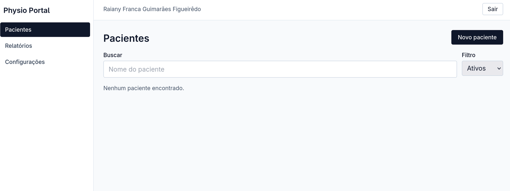

# physio-portal

Web app for a physiotherapist to manage patients, recurring sessions, weekly/monthly billing, and signed monthly PDF reports.



## Features

- Physiotherapist login (single-user, JWT).
- Patient CRUD with a direct WhatsApp link.
- Per-patient recurring schedule (fixed weekdays) with automatic session generation.
- Session status as **Realizada / Falta / Remarcada** — only `REALIZADA` bills.
- Dashboard with weekly/monthly totals plus a patient ranking.
- Monthly per-patient PDF with image signature and total in BRL.

## Stack

- **Monorepo:** npm workspaces (no Turborepo/Nx).
- **Backend (`apps/api`):** Express + `pg` (no ORM) + manual constructor-injection DI + Zod + JWT + pdfkit.
- **Frontend (`apps/web`):** React + Vite + TypeScript + React Query + react-router + Tailwind + react-hook-form.
- **Shared contracts (`packages/contracts`):** Zod schemas as the single source of truth for types and validation.
- **Database:** PostgreSQL with manual SQL migrations (paired `up.sql` / `down.sql`) and a custom runner.
- **Tests:** Vitest + supertest on the backend (real Postgres via Testcontainers), Vitest + Testing Library + MSW on the frontend. Coverage gate (lines, branches, functions, statements) is **100% on `apps/api`** and **80% on `apps/web`**. TDD is the default workflow — failing test first.

UI strings are written directly in PT-BR in JSX — the project is monolingual and has no i18n layer. See `plan.md` for the full schema, REST surface, and DI rules.

## Local development

```bash
npm install
docker compose up -d postgres   # local DB on :5433 (or use a system Postgres)
cp apps/api/.env.example apps/api/.env
npm run db:migrate -w apps/api
npm run db:seed -w apps/api
npm run dev                     # api on :3000, web on :5173
```

Default seed credentials (override via env):

| Env var          | Default                   |
| ---------------- | ------------------------- |
| `SEED_EMAIL`     | `fisio@example.com`       |
| `SEED_PASSWORD`  | `changeme`                |
| `SEED_FULL_NAME` | `Dra. Raiany`             |
| `SEED_CREF`      | `CREFITO-99999`           |
| `JWT_SECRET`     | `change-me-in-production` |

## Production

The API runs under **pm2** on the VPS; the static `apps/web/dist/` bundle is served by **host nginx**, which also reverse-proxies `/api/` and `/uploads/` to `http://localhost:3000`. The GitHub Actions workflow in `.github/workflows/deploy.yml` SSHes in, pulls, runs `npm install && npm run build`, and `pm2 restart physio-portal`.

## Commands

| Command                                 | Purpose                                            |
| --------------------------------------- | -------------------------------------------------- |
| `npm run dev`                           | Start API (`:3000`) and Web (`:5173`)              |
| `npm test`                              | Backend + frontend (100% gate on api, 80% on web)  |
| `npm run lint` / `npm run typecheck`    | Static checks across workspaces                    |
| `npm run db:migrate -w apps/api`        | Apply pending migrations                           |
| `npm run db:migrate:down -w apps/api`   | Revert the last applied migration                  |
| `npm run db:migrate:status -w apps/api` | Show applied vs pending migrations                 |
| `npm run db:seed -w apps/api`           | Seed the physiotherapist from env vars             |
| `docker compose up -d postgres`         | Boot the local Postgres container                  |

## Manual smoke checklist

After `npm run dev` (with Postgres up and migrations + seed applied), walk through the following:

1. **Login** — open http://localhost:5173, log in with the seeded credentials.
2. **Create a patient** — Pacientes → Novo paciente. Fill name, address, phone (`+5521987654321`), price, save. The card should appear with a working WhatsApp button.
3. **Schedule + generate sessions** — click the patient name, pick weekdays (e.g. Seg + Qua), set a startDate, **Salvar agendamento**, then **Gerar sessões deste mês**. The calendar fills with `SCHEDULED` cells.
4. **Mark sessions** — click a calendar cell, choose Realizada / Falta / Remarcada. The cell recolors and the **Mês** total updates only when the chosen status is Realizada.
5. **Reports dashboard** — Relatórios shows week/month totals and the patient ranking.
6. **Monthly PDF** — Relatórios → "Relatório mensal por paciente", select the patient + month, click **Download PDF**. The file should open as a signed PDF (signature placeholder if none uploaded).
7. **Profile + signature** — Configurações → edit name/CREF and save. Upload a small PNG and re-download the monthly PDF; the signature should now appear in the footer.

## License

[MIT](./LICENSE)
